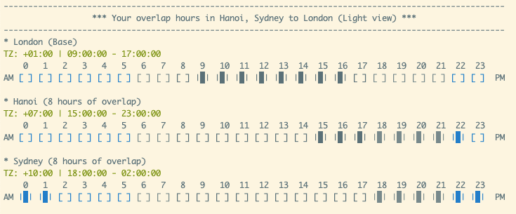
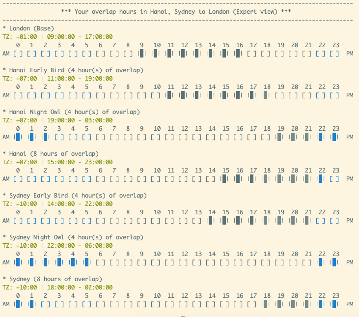

# TimeOverlap

Command line tool which visualizes time overlap for distributed teams.

## Features

* Handles as many time zones as you want
* Allows to specify start and end time
* Supports two modes: Light and Expert
* Lists all possible time zones
* Works well during Daylight Saving Time

## Installation

Install it yourself as:

    $ gem install time_overlap

## Contents

* [1. Usage](#1-usage)
* [2. Commands](#2-commands)
  * [2.1 light](#21-light)
  * [2.2 expert](#22-expert)
  * [2.3 list](#23-list)

## 1. Usage

    $ time_overlap help

## 2. Commands

### 2.1 light

    $ time_overlap light 9 17 London Hanoi Sydney



### 2.2 expert

    $ time_overlap expert 9 17 4 London Hanoi Sydney



### 2.2 list

    $ time_overlap list

```
List of available time zones:
-----------------------------
-12:00: International Date Line West
-11:00: American Samoa
-11:00: Midway Island
-10:00: Hawaii
-09:00: Alaska
-08:00: Pacific Time (US & Canada)
-08:00: Tijuana
-07:00: Arizona
-07:00: Chihuahua
-07:00: Mazatlan
-07:00: Mountain Time (US & Canada)
(...)
```

## Contributing

1. Fork it ( https://github.com/rafaltrojanowski/time_overlap/fork )
2. Create your feature branch (`git checkout -b my-new-feature`)
3. Commit your changes (`git commit -am 'Add some feature'`)
4. Push to the branch (`git push origin my-new-feature`)
5. Create a new Pull Request

This project is intended to be a safe, welcoming space for collaboration, and contributors are expected to adhere to the [Contributor Covenant](http://contributor-covenant.org) code of conduct.

## Copyright

Copyright (c) 2020 Rafał Trojanowski. See LICENSE for further details.
